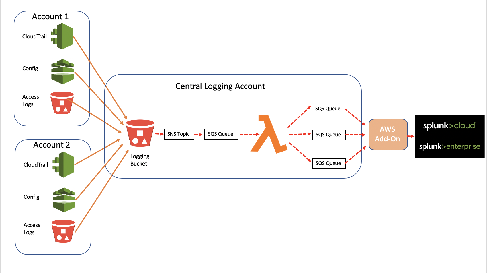

# SQS Lambda Function for Ingesting into Splunk using SQS Based S3 Input

This repository contains a sample function and instructions on setting up a function to allow a single S3 Bucket to be "split" into multiple SQS notifications for ingest into Splunk based on object name.

Intended audience: Splunk Admins / AWS Admins that are setting up ingest from AWS S3 into Splunk using the Splunk Add-On for Amazon Web Services (https://splunkbase.splunk.com/app/1876/ ).

**Overview**

Many organisations have a centralised S3 Bucket for log collection for multiple sources and accounts. For example, all Config, Cloudtrails and Access Logs logs may be routed into one central bucket for that organisation. The key prefix for these log objects generally provides an easy navigation around each account and log type – for example the object keys are in generally of the format:
<pre>Bucket/AWSLogs/account number/logtype/region/year/month/day/log</pre>

To collect these logs into Splunk, one of the best practice approaches is to use the Splunk Add-On for Amazon Web Services (https://splunkbase.splunk.com/app/1876/), using the “SQS Based S3” input. This input essentially uses an SNS notification on the bucket along with SQS message that the Add-on uses to identify new files in the bucket, which it then reads into Splunk. Please refer to Splunk documentation on setting this up : 
https://docs.splunk.com/Documentation/AddOns/released/AWS/SQS-basedS3

Although this is a very scalable solution, a challenge arises with this logging method when more than one source of logs is being dropped into a bucket, such as Cloud Trail and Config. This is due to the SNS notifications only being able to be triggered with a wild card set at the tail end of the prefix, such as /bucket/account/\*. It is not possible therefore with a centralised logging bucket to separate out one single notification for all Cloud Trails in the bucket, as this would require the notification to be set on bucket/AWSLogs/\*/CloudTrail/\* which is not valid.

A way around this of course is to set up multiple notifications topics, corresponding SQS queues and an Add-On Input for each account, which over time can be quite complicated and difficult to manage/maintain. An example of this could be where 100 accounts with 3 log types each would result in 300 SNS topics, 300 SQS queues (each with another dead letter queue) and 300 Add-on Inputs.

There is however another much easier setup and approach that can be taken using Lambda functions. Instead of having separate SNS notifications for each account, one SNS topic for the whole bucket could trigger a lambda function via an SQS queue, which in turn “routes” the notification into other SQS queues depending on the log source, which are then linked to an add-on input of the correct “source type”. Using this approach, one bucket could have multiple accounts and sourcetypes without the need for a large setup of SNS topics, SQS queues and Add-On inputs. With the same example above of 100 accounts and 3 logs, only 1 SNS topic would be needed, with only 4 SQS queues (with each queue having a dead-letter queue).
(It is also possible to go direct from SNS into a Lambda function avoiding 1 more SQS queue, but in the event of a function failure, there no way to retrieve the SNS notification, whereas the queue would still contain the notification)

Instructions are provided here on setting this up.

The sample function provides a use case where 3 different sources may be available in an S3 bucket. It uses function environment variables to set the queue names for each of the different sources, as well as a default queue for any other object that is put there. The function also can take a exclusion list environment variable to “ignore” certain objects that may also be copied into the bucket but not needed to be sent to Splunk. 

Other use cases may be added to the function, such as sending to different queues based on account numbers. This could enable logs from certain groups of accounts to be sent to different Splunk indexes for security or retention requirements.
